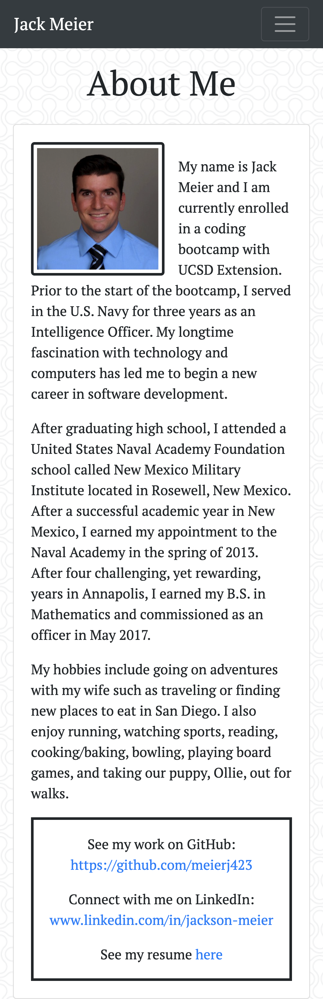
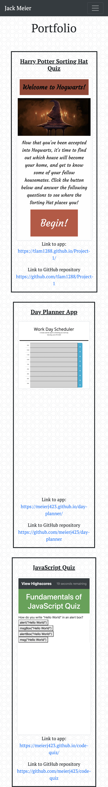
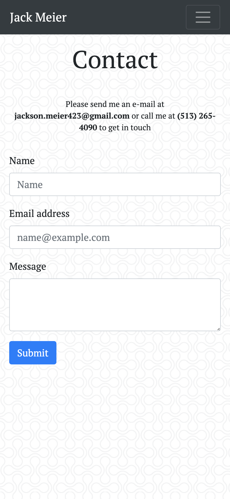

# responsive-portfolio

This webpage inclues a short bio, a list of a few projects, and a contact page.

    -WHEN the user loads the page, they are presented with the About Me page
        -The About Me page includes an image of myself, a short bio, and links to my resume as well as my GitHub and LinkedIn profiles.
        -The user may navigate to either the Portfolio page or the Contact page.
    -WHEN the users loads the Portfolio page, they are presented with a list of projects I have completed.
        -Each list item includes the title, screenshot, and links to the respective app.
    -WHEN the user loads the Contact page, they are presented with a message containing my e-mail and phone number as well as a form to send a message.

See URL to demo site: https://meierj423.github.io/responsive-portfolio/

